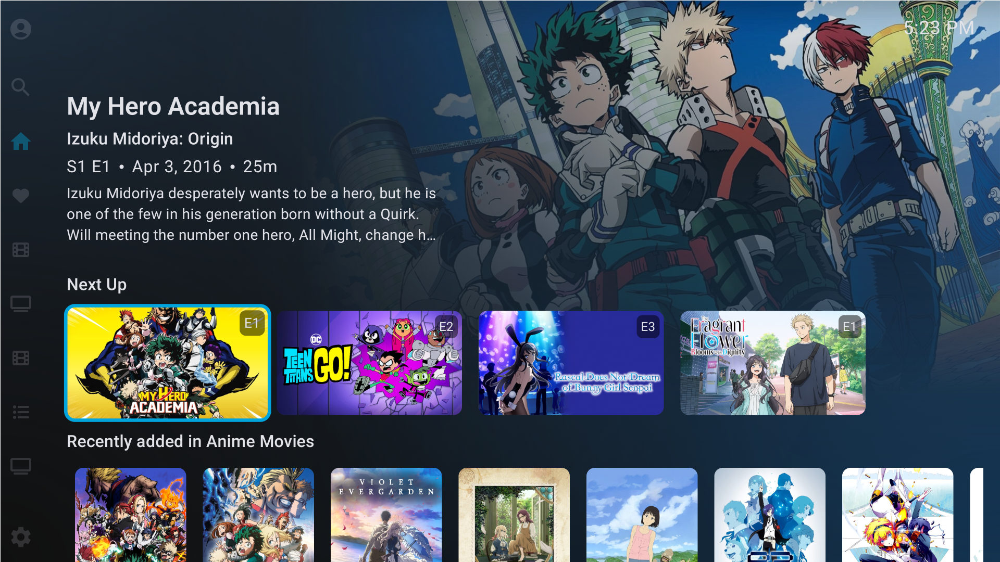
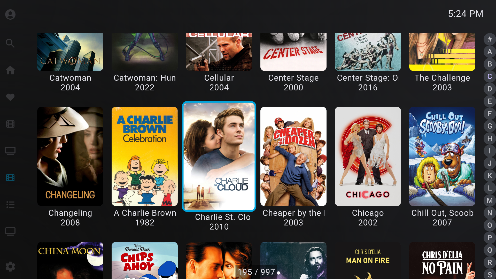
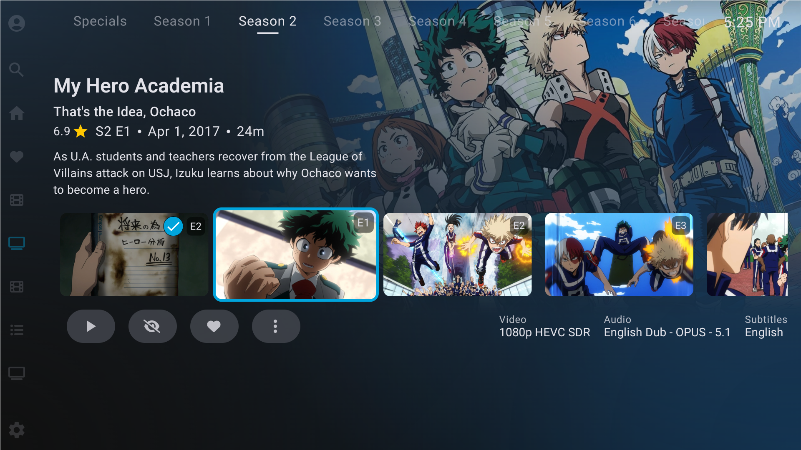
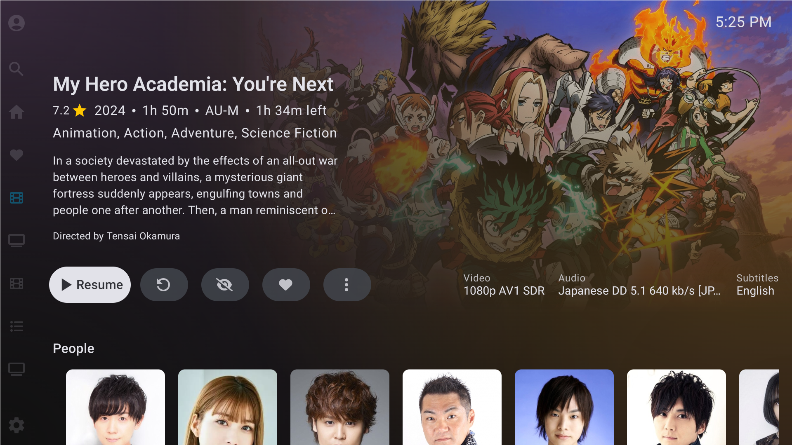

# Halfin - A fork of Wholphin - an OSS Android TV client for Jellyfin

> AI was used in the making of this fork.

[Wholphin](https://github.com/damontecres/Wholphin) is an open-source Android TV client for Jellyfin. It aims to provide a different app UI that's inspired by Plex for users interested in migrating to Jellyfin. This fork aims to implement quality of life changes to enhance the UX and bring it more in line with the Plex experience.

## Features of Wholphin

- A navigation drawer for quick access to libraries, search, and settings from almost anywhere in the app
- Show Movie/TV Show titles when browsing libraries
- Play TV Show theme music, if available
- Plex inspired playback controls, such as:
  - Using D-Pad left/right for seeking during playback
  - Quickly access video chapters during playback
  - Optionally skip back a few seconds when resuming playback
- Other (subjective) enhancements:
  - Subtly show playback position along the bottom of the screen while seeking w/ D-Pad
  - Force Continue Watching & Next Up TV episodes to use their Series posters
- Different media playback engines, including:
  - Default ExoPlayer/Media3
  - Experimental MPV

## Features of This Fork
- Dynamic backgrounds created by extracting color palettes from backdrops.
- Transparent navigation drawer and headerm allowing backdrops and colors to reach the edges of the screen
- Series thumbnails for Continue Watching and Next Up rows
- Resized cards to reduce clutter
- Consistent fonts and spacing across the app
- Libass support in Exoplayer to support chipsets that can't use mpv

### Roadmap

See [here for the Wholphin roadmap](https://github.com/damontecres/Wholphin/wiki#roadmap).
Until these quality of life changes materialize in the main app, I plan to keep this fork in sync with new releases.

## Compatibility

Requires Android 7.1+ (or Fire TV OS 6+) and Jellyfin server `10.10.x` (tested on primarily `10.10.7`).

Wholphin is tested on a variety of Android TV/Fire TV OS devices, so Halfin should work on those devices too, but if you encounter issues, please file an issue!

## Acknowledgements

- Primarily, thanks to damontecres for creating Wholphin. This wouldn't be posible without you
- Thanks to the Jellyfin team for creating and maintaining such a great open-source media server
- Thanks to the official Jellyfin Android TV client developers, some code for creating the device direct play profile is adapted from there
- Thanks to the Jellyfin Kotlin SDK developers for making it easier to interact with the Jellyfin server API
- Thanks to numerous other libraries that make app development even possible

## Additional screenshots

### Movie library browsing

### Series page

### Movie details

